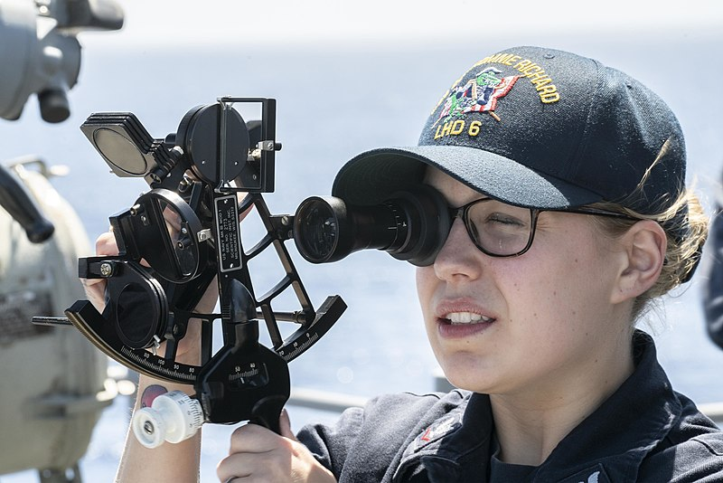

# celestial-navigation

Contains a simple python script to be used for [celestial navigation](https://en.wikipedia.org/wiki/Celestial_navigation).  
Sights have to be obtained using a sextant, a nautical almanac and an accurate clock.  
The python script takes care of the sight reduction. For two sights you will get two possible coordinates. For three or more sights you will get one coordinate (calculated as a mean value). 

The python script only uses basic libraries (no numpy or similar) and could be installed in [PyDroid](https://play.google.com/store/apps/details?id=ru.iiec.pydroid3) to allow for use on a mobile phone. 

A [digital version of the Nautical Almanac](NAtrad(A4)_2024.pdf) for 2024 is included in this repository. 

A more detailed description of celestial navigation can be found [here](https://www.waypointamsterdam.com/Handy_stuf/Short_Guide_To_Astro_navigation.pdf).

## 1. Making sights

You create a sight with code like this. (You can also see a complete example in the python script [starfixdata.py](starfixdata.py) and also [a corresponding excel file](chicago.ods). 
This sample is taken using a star atlas ([Stellarium](https://en.wikipedia.org/wiki/Stellarium_(software))) from a point in central Chicago on May 5th 2024.) 

    c = Sight (date                 = "2024-05-06", \
                  object_name          = "Vega", \
                  time_hour            = 4, \
                  time_minute          = 4, \
                  time_second          = 13, \
                  gha_time_0_degrees   = 284, \
                  gha_time_0_minutes   = 30.4, \
                  gha_time_1_degrees   = 299, \
                  gha_time_1_minutes   = 32.9, \
                  decl_time_0_degrees  = 38, \
                  decl_time_0_minutes  = 48.1, \
                  decl_time_1_degrees  = 38, \
                  decl_time_1_minutes  = 48.1, \
                  measured_alt_degrees = 30, \
                  measured_alt_minutes = 16, \
                  measured_alt_seconds = 24.6, \
                  sha_diff_degrees     = 80, \
                  sha_diff_minutes     = 33.4 \
                  )
                  
The data is picked from your clock, sextant and the Nautical Almanac in the following way

| Argument             | Description                               | Remark                                                         | Collected From | 
| :-------------       | :-------------                            | :-------------                                                 | :------------- |
| date                 | Current day                               | Not used in calculations. Only mnemonic.                       | N/A |
| object               | Name of celestial object                  | Not used in calculations. Only mnemonic.                       | N/A |
| time_hour            | Observation time - Hours (0-23)           | In UTC. Not used in calculations. Only mnemonic.               | Clock |
| time_minute          | Observation time - Minutes (0-59)         | In UTC.                                                        | Clock |
| time_second          | Observation time - Seconds (0-59)         | In UTC.                                                        | Clock | 
| gha_time_0_degrees   | GHA degrees reading for this hour         | For stars use GHA of Aries.                                    | Nautical Almanac |
| gha_time_0_minutes   | GHA minutes reading for this hour         | Can be zero (use decimal degrees). For stars use GHA of Aries. | Nautical Almanac |
| gha_time_1_degrees   | GHA degrees reading for next hour         | For stars use GHA of Aries.                                    | Nautical Almanac |
| gha_time_1_minutes   | GHA minutes reading for next hour         | Can be zero (use decimal degrees). For stars use GHA of Aries. | Nautical Almanac |
| decl_time_0_degrees  | Declination degrees reading for this hour |                                                                | Nautical Almanac |
| decl_time_0_minutes  | Declination minutes reading for this hour | Can be zero (use decimal degrees)                              | Nautical Almanac |  
| decl_time_1_degrees  | Declination degrees reading for next hour |                                                                | Nautical Almanac |
| decl_time_1_minutes  | Declination minutes reading for next hour | Can be zero (use decimal degrees)                              | Nautical Almanac |
| measured_alt_degrees | Altitude of object in degrees (0-90)      |                                                                | Sextant |
| measured_alt_minutes | Altitude of object in minutes (0-60)      | Can be zero (use decimal degrees)                              | Sextant |
| measured_alt_seconds | Altitude of object in seconds (0-60)      | Can be zero (use decimal degrees/minutes)                      | Sextant |
| *sha_diff_degrees*   | SHA of star vs Aries in degrees           | Only use for stars. Otherwise skip                             | Nautical Almanac |
| *sha_diff_minutes*   | SHA of star vs Aries in minutes           | Only use for stars. Otherwise skip                             | Nautical Almanac |

### Atmospheric refraction

The measured altitude values (attributes measured_alt_degrees, measured_alt_minutes and measure_alt_seconds) are corrected for atmospheric refraction using [Bennett's empirical formula](https://github.com/alinnman/celestial-navigation/assets/48103392/482c59d3-dcda-4079-ad99-67d5185426fc)

$R = \cot \left( h_a + \frac{7.31}{h_a + 4.4} \right)$

Where $R$ is the refraction in arc minutes and $h_a$ is the measured angle from zenith

## 2. Sight reduction

### 2.1. Using two sights

Using two star fixes a sight reduction can be done in the following way 

    from starfix import Sight, SightCollection, getRepresentation
	
    a = Sight (....Parameters....)
    b = Sight (....Parameters....)
    
    collection = SightCollection ([a, b])
    intersections = collection.getIntersections ()
    print (getRepresentation(intersections,1))
    
The result will be a tuple of **two** coordinates (intersections of two circles of equal altitude). These intersections can be located far away from each other.
You will have to decide which one of them is the correct observation point, based on previous knowledge of your location. 

The intersections are calculated using an algorithm based on [this article](https://math.stackexchange.com/questions/4510171/how-to-find-the-intersection-of-two-circles-on-a-sphere)  
This is a short outline of the algorithm. Two circles $A$ and $B$ define the circles of equal altitude defined from the sighting data as described above. The circles relate to a *sight pair* $S_{p_{1,2}} = \{s_1, s_2\}$ which we will come back to later. 

$A = \lbrace p \in \mathbb{R}^3 \mid p \cdot a = \cos \alpha \land |p| = 1 \rbrace$  
$B = \lbrace p \in \mathbb{R}^3 \mid p \cdot b = \cos \beta \land |p| = 1 \rbrace$ 

We aim for finding the intersections $p_1$ and $p_2$ for the circles $A$ and $B$ and the point $q$ being the midpoint between $p_1$ and $p_2$. 

Using the Pythagorean Theorem for a Sphere it is easy to see this: 

$\cos aq \cos pq = \cos \alpha$  
$\cos bq \cos pq = \cos \beta$  

From which we derive this

$q \cdot (a \cos \beta - b \cos \alpha) = 0$

Applying two cross-products we can get the value for $q$

$q = \mathrm{normalize}((a \times b) \times (a \cos \beta - b \cos \alpha))$

Now we can find the intersection points by rotating $q$ for an angle of $\rho$ along a rotation axis $r$.  
$\rho$ and $r$ are calculated this way:

$r = (a \times b) \times q$  
$\rho = \arccos(p \cdot q) = \arccos\left(\frac{\cos \alpha}{a \cdot q}\right)$

The final rotation is accomplished using [Rodrigues/Gauss rotation formula](https://en.wikipedia.org/wiki/Rodrigues%27_rotation_formula).

$p_{\mathrm{rot}} = q \cos \rho + \left( r \times q \right) \sin \rho + r \left(r \cdot q \right)\left(1 - \cos \rho \right)$ 

Apply the formula above for $\rho$ and $-\rho$ and you will get the two intersection points $p_1$ and $p_2$. 

### 2.2 Using three or more sights

Using three (or more) sights a sight reduction can be done in the following way 

    from starfix import Sight, SightCollection, getRepresentation
	
    a = Sight (....Parameters....)
    b = Sight (....Parameters....)
    c = Sight (....Parameters....)
    
    collection = SightCollection ([a, b, c]) # Add more sights if needed
    intersections = collection.getIntersections ()
    print (getRepresentation(intersections,1))

A *sight* is defined as a collection of data as described in the section 1 above, i.e. recorded data for a celestial object for a specific time. 

A collection contains of a set of sights (star fixes) $S$

$S_{\mathrm{sights}} = \lbrace s_1, s_2, \dots s_n  \rbrace $

Now set up a set of sight pairs

$S_p = \lbrace {S_p}_{i,j} | i<=n \land j<=n \land j>i+1 \rbrace$

It is easy to see that the number of sight pairs (the cardinality) can be calculated like this

$|S_p| = \frac{n^2 + n}{2} $

For each sight pair we now collect the two corresponding intersection points ($L$ = left, $R$ = right) using the algorithm described in 2.1 above.

$S_{p,i,j} \to \lbrace I_{p,i,j,L},I_{p,i,j,R} \rbrace$

This will result in a set of intersection points

$I_p = \lbrace I_{p,i,j,O} | O \in \{L,R \} \land i<=n \land j<=n \land j>i+1 \rbrace$

The cardinality can easily be shown as

$|I_p| = n^2 + n $

For each pair of intersection points we calculate the distance. The distance is easily calculated using this formula. 

$d\left(x,y\right) = \sin xy $

This will give us the following set

$D = \lbrace d\left(I_k,I_l\right) | k < |I| \land l < |I| \land k <> l \rbrace$

The cardinality of $D$ can be calculated

$|D| = {|I|}^2 - {|I|} = n^4 + 2n^3 - n$

We now need to eliminate all "false" intersections and only choose those close to the probable location of the observer. 

The final part of the algorithm sorts the set $D$ to extract a maximum of $\frac{n^2-n}{2}$ intersection points, and also applying a maximal allowed distance limit (which defaults to 100 km). 

The final result will be a **single** mean value of the extracted intersection points. 

