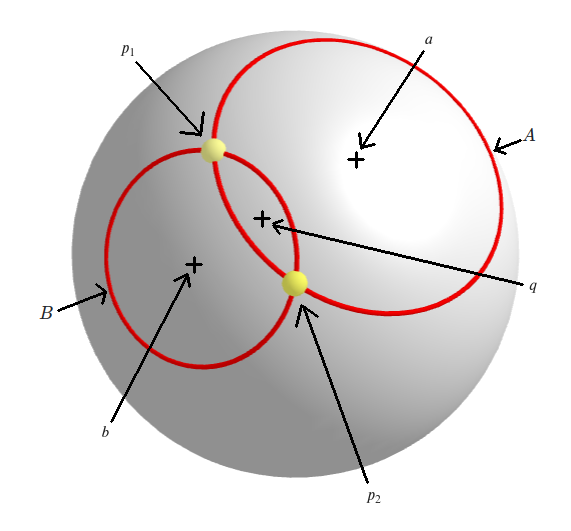

<!---
    © August Linnman, 2025, email: august@linnman.net
    MIT License (see LICENSE file)
-->

# celestial-navigation

## Online Demo

Try out an
[online demo](https://colab.research.google.com/drive/1bZt35-P6aiPlKWktyXgU3he6Di_N-PpA)
of this toolkit! 
*Opens in [Google Colab](https://colab.research.google.com).
You need a Google/Gmail account to run the code in the notebook*.

## Mobile app

You can try an Android app for basic sight reductions, based on this library.
Download it from
[Google Play here](https://play.google.com/store/apps/details?id=linnman.net.celeste)

## Celestial Navigation for Dummies

You use the sextant to read the altitude (angle) of the
Sun, the Moon, a planet or a star
above the horizon. Repeat this several times. For each reading you get
a circle that can be drawn on a map.
Now see where these circles intersect. This will reveal your position. 
In this picture we were located in Chicago.

A simple calculator for this can be
[found&nbsp;here](https://colab.research.google.com/drive/1tCY3mvpLlzUKot2Rul3I4ZobVCzzRBtT?usp=sharing)

## Table of Contents

1. [Introduction](#introduction)
    1. [Links](#links)
    1. [Overview](#overview)
1. [Making Sights](#making-sights)
    1. [Atmospheric Refraction](#atmospheric-refraction)
    1. [Dip of Horizon](#dip-of-horizon)
    1. [Ignored Corrections](#ignored-corrections)
1. [Sight Reduction (Stationary observer)](#sight-reduction)
    1. [Short note on Earth oblateness](#ellipsoid)
    1. [Using two sights](#using-two-sights)
    1. [Using three or more sights](#using-three-or-more-sights)
    1. [Running the chicago script](#run-chicago-script)
    1. [Azimuth calculation](#azimuth)
    1. [Terrestrial Navigation](#terrestrial)
1. [Dead Reckoning (Moving observer)](#dead-reckoning)
    1. [From <tt>Sight</tt> to <tt>Sight</tt>](#run-sea-script)
    1. [From <tt>LatLon</tt> to <tt>Sight</tt>](#run-sea-script-2)
    1. [Intercept a circle](#intercept-dr)
    1. [Intercept a bearing](#intercept)
    1. [Pure dead reckoning](#pure_dr)
1. [A real-life example](#real-life)
1. [Sextant Calibration](#calibration)
1. [Chronometer Handling](#chronometer)
1. [Some notes on accuracy](#accuracy)
    1. [Handling errors](#handling)
    1. [Algorithm errors](#algorithm)
1. [The machine-readable nautical almanac](#mr)
1. [Licenses](#licenses)

## 1. Introduction 

## 1.1 Links 

For more information on **installation** and usage of the Python scripts
and the Celeste mobile app [see here](INSTALL.md).

A short explanation of the logical steps and algorithms used in this toolkit can
be [found here](WORKFLOW.md).

Digital versions of the Nautical Almanac (in PDF format)
are [included in this repository](./nautical_almanacs/).
A machine-readable nautical almanac (in CSV format) can be
[found here](./sample_data/)

A more detailed description of celestial navigation can be
[found&nbsp;here](https://www.waypointamsterdam.com/Handy_stuf/Short_Guide_To_Astro_navigation.pdf). 

A historical document, the Admiralty Navigational Manual (1938),
from His Majestys Stationary Office (UK) can be
[found here](https://archive.org/details/dli.ernet.211556/mode/2up).

If you wonder why I wrote this in the first place, then see
[this short explanation](WHY.md), where I also give some tips
on more sources.

If you want to contribute to the project then see [this page](CONTRIBUTING.md).

## 1.2 Overview 

This project contains a toolkit (written in Python) to be used for
[celestial navigation](https://en.wikipedia.org/wiki/Celestial_navigation)
together with some demos and documentation.
You can use the toolkit on a mobile phone without internet connection.
If you also have access to a solar powered battery (powerbank) you have a tool
useful while traveling in remote places or on the ocean. An Android app
with the toolkit embedded is available for this.
The toolkit (or the mobile phone app) can be useful in a scenario
where you are the victim of
[GPS Spoofing](https://en.wikipedia.org/wiki/GNSS_spoofing).
The app can be connected to marine plotting equipment as a
fallback to GPS receivers.

Sights (altitude measurements) have to be obtained using a sextant,
a nautical almanac (printed or digital) and an accurate chronometer.
The toolkit takes care of the **sight reduction**
(conversion to estimated location on Earth),
a task that traditionally is performed with careful manual work using special
tables (sight reduction tables), pen, dividers and specialized plotting charts.
Using a calculator can speed up this manual task, and also reduce possible
(human) errors.
A **computer** (or mobile phone) can do it even quicker,
and this toolkit will typically perform
a sight reduction in 1-2 milliseconds.  

* The toolkit supports **stationary** observations, i.e. when observations are
  made from a single position,
  using multiple sights where the position is determined from the
  intersection(s) of the small circles of equal altitude.
  For two sights you will get two possible coordinates.
  For three or more sights you will get one coordinate
  (calculated as a mean value).
* There is also support for **dead reckoning** observations,
  typically at sea on a moving ship. This also needs a working compass and a
  chip log or similar.
  See [below](#dead-reckoning) for more information.
* As a bonus there is also support for **terrestrial navigation**.
  See [below](#terrestrial) for more information.

## 2. Making sights 

The description below focuses on writing code for the python scripts directly.
We also go through the underlying maths.
For using the Android app see [this description](APPDOC.md).

You create a sight with code like this (for the Sun). You specify data from your
sextant and chronometer. You also add tabular data from the
Nautical Almanac. This data is given from the current hour of the observation,
and the next hour.
(You don't have to enter linear factors etc. from the almanac).

    a = Sight (object_name          = "Sun", \
               set_time             = "2024:05:05 15:55:18+00:00" \
               measured_alt         = "55:8:0" \
              )

You can also see a complete example in
[a python script](starfixdata_stat_mr_1.py)
and also [a corresponding excel file](chicago.ods).
This sample is built using altitudes taken from the star atlas
[Stellarium](https://github.com/Stellarium/stellarium)
from a point in central Chicago on May 5th 2024.
In other words: No sextant readings were made and the accuracy is very good.
(Running this sample will give you an accuracy of just some 100 meters).

The data is picked from your chronometer (clock), dead reckoning (navigation),
weather information, sextant and the Nautical Almanac in the following way.

Arguments in *italics* are optional.

| Argument | Description | Remark | Collected From |
| :------------- | :------------- | :------------- | :------------- |
| object_name | Name of celestial object. | Used to collect data from the [machine-readable nautical almanac](#mr) | N/A |
| set_time | Time for observation | [Use ISO 8601 format](https://en.wikipedia.org/wiki/ISO_8601) | Chronometer |
| *estimated_position* | An estimation (DR) of the current position. Used for getting better precision regarding oblateness (ellipsoid) calculations and for better elimination of false intersections. NOTE: This position will be re-used for all subsequent <tt>Sight</tt> objects if not re-specified. | A <tt>LatLonGeodetic</tt>. Must be specified at least for the first Sight. | Dead reckoning / Navigation |
| *gha_time_0*   | GHA reading for this hour. | String with format "DD:MM:SS". For stars use GHA of Aries. If omitted the [machine-readable nautical almanac](#mr) will be used. | Nautical Almanac |
| *gha_time_1*   | GHA reading for next hour. | String with format "DD:MM:SS". For stars use GHA of Aries. If omitted the [machine-readable nautical almanac](#mr) will be used. | Nautical Almanac |
| *decl_time_0*  | Declination reading for this hour. | String with format "DD:MM:SS". If omitted the [machine-readable nautical almanac](#mr) almanac will be used. |  Nautical Almanac |
| *decl_time_1*  | Declination reading for next hour. | String with format "DD:MM:SS". Can be skipped for stars. Default = decl_time_0. If omitted for a **solar system object** then the [machine-readable nautical almanac](#mr) will be used. | Nautical Almanac |
| *sha_diff*   | SHA of star vs Aries in degrees. | String with format "DD:MM:SS". Only use for stars. Otherwise skip. Default = "0". If omitted for a **star** then the [machine-readable nautical almanac](#mr) will be used.| Nautical Almanac.|
| *horizontal_parallax* | Correction for horizontal parallax.  | Used for the Moon. *HP* value. Default = 0. If omitted for the **Moon** then the [machine-readable nautical almanac](#mr) will be used. | Nautical Almanac |
| *limb_correction* | Correction for limb measurements.  | Typically used for Moon or Sun. Set to 0 (central), -1 (lower limb) or 1 (upper limb). Default = 0 | Your observation |
| measured_alt | Altitude of object in degrees. | String with format "DD:MM:SS". | Sextant |
| *index_error_minutes*    | Specify known index error of sextant. | Default = 0. | Sextant |
| *artificial_horizon*    | Indicates if you use an artificial horizon. True or False. | All sextant readings will be divided by 2. Default = <tt>False</tt>.          | N/A |
| *no_dip* | Use this to eliminate dip of horizon calculation. <tt>True</tt> or <tt>False</tt> | Default = <tt>False</tt> | N/A |
| *observer_height*    | Height of observer above sea level or ground in meters (>= 0). | Only relevant for observations using natural horizon. For artificial horizon use 0. Default = 0.          | Height Measurement |
| *sextant*            | An object defining a specific used sextant.        | See [this code sample](xtras/starfixdata_xtra_home.py) for details. Default = <tt>None</tt>.       | Sextant Calibration |
| *chronometer*            | An object defining a specific used chronometer.        | See [this code sample](xtras/starfixdata_xtra_home.py) for details. Default = <tt>None</tt>.       | Chronometer Calibration |
| *temperature*            | Measured temperature at observing point. (degrees celsius)        |  Default = 10    | Observations or meteorology information |
| *dt_dh* | Temperature gradient (degrees celsius / meter) | default = -0.01 | Observations or meteorology information |
| *pressure* | Measured pressure at observing point. (kPa) | Default = 101 | Observations or meteorology information |
| *ho_obs* | Set to <tt>True</tt> if dip and refraction corrections should be omitted | Default = <tt>False</tt> | N/A |

### 2.i. Atmospheric refraction

The measured altitude value (parameter *measured_alt*)
is corrected for atmospheric refraction using
[Bennett's empirical formula](https://en.wikipedia.org/wiki/Atmospheric_refraction#Calculating_refraction)
with adjustments for temperature and pressure.

$R = \cot \left( h_a + \frac{7.31}{h_a + 4.4} \right)
\frac{P}{101}\frac{283}{273+T}$

where

* $R$ is the refraction in arc minutes.
* $h_a$ is the measured angle.
* $P$ is pressure in millibars.
* $T$ is temperature in Celsius.

### 2.ii. Dip of horizon

If you specify the *observer_height* parameter you will correct for the dip of
the horizon. This is useful for observations from a ship deck at sea, or from a
hill/mountain with flat surroundings.
The dip is calculated using this formula

$a_{\text{diff}}= \arccos{ \frac{R}{R+h}}$

where

* $a_{\text{diff}}$ is the calculated dip (in radians)
* $R = \frac{r}{1-k}$ (corrected radius of Earth for geodetic refraction)
* $h$ is the elevation of the observer (in meters) above the horizon.
* $r$ is the radius of the Earth (in meters).
* $k = 503\frac{P}{T^2}\left(0.0342+\frac{dT}{dh}\right)$
  (refraction coefficient)
* $P$ is the pressure (in millibars)
* $T$ is the temperature (in Kelvins)
* $\frac{dT}{dh}$ is the temperature gradient. (Rate of temperature change with
 increasing elevation).

If you use an artificial horizon the dip is always zero,
and the *observer_height* parameter should be zero.

For more information about the formula above please refer to
[this article](https://agupubs.onlinelibrary.wiley.com/doi/10.1029/2010JD014067)

### 2.iii. Ignored Corrections

* Refraction correction is simple (see above), but probably good enough for
basic celestial navigation.

* More elaborate geodetic corrections have not been applied,
  such as detailed geoids taking care of deviations of the gravitational field.

See [more about future plans](CONTRIBUTING.md).

## 3. Sight reduction (Stationary observer)

### 3.i. Short note on Earth oblateness

The code contains corrections for Earth oblateness, and intersection work uses
algorithms adopted to the
[WGS-84 ellipsoid](https://en.m.wikipedia.org/wiki/World_Geodetic_System).
These corrections are briefly explained below.

### 3.ii. Using two sights

Using two star fixes a sight reduction can be done in the following way:

    from starfix import Sight, SightCollection, get_representation, IntersectError
 
    a = Sight (....Parameters....)
    b = Sight (....Parameters....)
    
    collection = SightCollection ([a, b])
    try:
        intersections, _, _ = collection.get_intersections ()
        print (get_representation(intersections,1))
    except IntersectError as ve:
        print ("Cannot get perform a sight reduction. Bad sight data.\n" + str(ve))   

You can enter an estimated position (Dead Reckoning Position, **DRP**)
as a parameter.
This will reduce the number of calculations and eliminate intersections being
far off the place where you assume you are located.

        intersections, fitness, diag_output = collection.get_intersections \
        (estimated_position = LatLon (57,19))

The result will be a tuple of **two** coordinates (intersections of two circles
of equal altitude). These intersections can be located far away from each other.
You will have to decide which one of them is the correct observation point,
based on previous knowledge of your location.

The intersections are calculated using an algorithm based on
[this article](https://math.stackexchange.com/questions/4510171/how-to-find-the-intersection-of-two-circles-on-a-sphere)
 
This is a short outline of the algorithm.

For both measurements take note of the measured **altitude**
(from your **sextant**), ${f_1}_s$ and ${f_2}_s$.
Note: these measurements are relative to Earth surface, i.e. they
refer to a **geodetic** model.

You also need an **estimated position** $p_d$
(dead reckoning position) 
*The accuracy of this position will give precision to the sight reduction,*
*but even a rather bad estimation can be corrected using an iterative algorithm*
*discussed further down.*

Using your **chronometer** (clock) register the corresponding
times $t_1$ and $t_2$ for the two measurements.

From the [Nautical Almanac](https://en.wikipedia.org/wiki/Nautical_almanac),
using the timestamps $t_1$ and $t_2$, get the
[geographic position](https://www.celestialprogramming.com/snippets/geographicPosition.html)
vectors (GP:s) $a$ and $b$.

Note: The GP:s $a$ and $b$ are **geocentrical**,
and located on the **unit sphere** $S_u$.

$S_u = \lbrace p \in \mathbb{R}^3 \mid \left|\left|p\right|\right| = 1 \rbrace$

All calculations for intersections are made on the unit sphere.

$a \in S_u$
 
$b \in S_u$

The altitudes are successively corrected for oblateness ($C_{\text{obl}}$),
[refraction](#2i-atmospheric-refraction) ($C_{\text{refr}}$)
and [horizon dip](#2ii-dip-of-horizon) ($C_{\text{dip}}$),
 producing corrected altitudes $f_1$ and $f_2$

$f_1={C_{\text{obl}}\left(p_d,a,C_{\text{refr}}\left(C_{\text{dip}}\left({f_1}_s\right)\right)\right)}$

$f_2={C_{\text{obl}}\left(p_d,b,C_{\text{refr}}\left(C_{\text{dip}}\left({f_2}_s\right)\right)\right)}$

The oblateness correction function is defined like this: : 
$a_1=\frac{\pi}{2}-\arccos{(p \cdot f)}$ 
$a_2=\frac{\pi}{2}-\arccos{(\text{D2C}(p) \cdot f)}$ 
$C_{\text{obl}}(p,a,f):=a+(a_2-a_1)$

The symbol $\cdot$ denotes a
[dot product](https://en.wikipedia.org/wiki/Dot_product).

The $\text{D2C}()$ function converts from geodetic to geocentrical coordinates.
See
[this article](https://en.wikipedia.org/wiki/Geographic_coordinate_conversion)
for more information.  Also see code
[&rarr;](https://github.com/alinnman/celestial-navigation/blob/bb71731f8c4be417b20bf55676bc18e6492028cf/starfix.py#L1180).

From here we continue all calculations in a **geocentrical** (spherical)
coordinate system on the unit sphere $S_u$.

Define angles $\alpha$ and $\beta$ this way:
$\alpha = \frac{\pi}{2} - f_1$, $\beta = \frac{\pi}{2} - f_2$

Now we can define two circles of equal altitude, $A$ and $B$.

$A = \lbrace p \in S_u \mid
p \cdot a = \cos \alpha \rbrace$  
$B = \lbrace p \in S_u \mid
p \cdot b = \cos \beta  \rbrace$

The notation $\left|\left|x\right|\right|$ denotes the
[absolute value](https://en.wikipedia.org/wiki/Absolute_value#Vector_spaces)
of the vector $x$.

The circles relate to a *sight pair* $S_{p_{1,2}} = \{s_1, s_2\}$
which we will come back to later.

We aim for finding the intersections $p_1$ and $p_2$ for the circles $A$ and
$B$ ($A \bigcap B$) and the point $q$ being the midpoint
between $p_1$ and $p_2$.

Using the
[Pythagorean Theorem for a Sphere](https://en.wikipedia.org/wiki/Spherical_law_of_cosines)
it is easy to see this:

$(\cos\left(a\cdot q\right)) (\cos\left(p\cdot q\right)) = \cos \alpha$  
$(\cos\left(b\cdot q\right)) (\cos\left(p\cdot q\right)) = \cos \beta$  

From which we derive this

$q \cdot (a \cos \beta - b \cos \alpha) = 0$

Applying two [cross products](https://en.wikipedia.org/wiki/Cross_product)
(symbol $\times$) and a normalization we can get the value for $q$

$q = N \left( (a \times b) \times (a \cos \beta - b \cos \alpha) \right)$

where $N$ is normalization

$N(x) = \frac{x}{\left|\left|x\right|\right|}$

Now we can find the intersection points by rotating $q$ for an angle of $\rho$
along a rotation axis $r$.  
$\rho$ and $r$ are calculated this way:

$r = \left(a \times b\right) \times q$  
$\rho = \arccos(p \cdot q) = \arccos\left(\frac{\cos \alpha}{a \cdot q}\right) =
\arccos\left(\frac{\cos \beta}{b \cdot q}\right)$

The final rotation is accomplished using
[Rodrigues/Gauss rotation formula](https://en.wikipedia.org/wiki/Rodrigues%27_rotation_formula)
.

$P_{\mathrm{rot}}(\tau) = q \cos \tau + \left( r \times q \right) \sin \tau +
r \left(r \cdot q \right)\left(1 - \cos \tau \right)$

Apply the formula above for $\rho$ and $-\rho$ and you will get the two
intersection points $p_1$ and $p_2$.

$p_1 = P_{\mathrm{rot}}(\rho)$ 
$p_2 = P_{\mathrm{rot}}(-\rho)$

**One of these two points matches your location**.

The final coordinates $p_1$ and $p_2$ are converted
**back** to **geodetic coordinates**, ${p_1}_d$ and ${p_2}_d$. 

${p_1}_d = C2D(p_1)$ 
${p_2}_d = C2D(p_2)$

The used function ($\text{C2D}$) for this conversion is numerical/iterative.
For more details, see
[this article](https://en.wikipedia.org/wiki/Geographic_coordinate_conversion)
and
[this&nbsp;reference](https://www.tandfonline.com/doi/abs/10.1179/sre.1976.23.181.323)
(Bowring's iterative formulas).
 (The function $\text{C2D}$ is the inverse of $\text{D2C}$,
i.e $\text{C2D}(\text{D2C}(p))==p$) 
Also see code
[&rarr;](https://github.com/alinnman/celestial-navigation/blob/bb71731f8c4be417b20bf55676bc18e6492028cf/starfix.py#L1147)
and this explanation
[&rarr;](https://en.wikipedia.org/wiki/Geographic_coordinate_conversion#Newton%E2%80%93Raphson_method).

When performing the calculation above we also deduce the intersection angle for
the two small circles (**fitness**). This angle will be used later on when we
compare many different intersections. When the angle is small the error margin
will be rather high and this can be used to reduce the effects of intersections
with big uncertainty. An angle close to 90 degrees however indicates a rather
precise measurement and this should be prioritized.

This is the algorithm for calculating the fitness:

$d_1 = N((p_1 - a) \times a)$  
$d_2 = N((p_1 - b) \times b)$

From this we calculate the fitness factor $\phi$:

$\phi = \left|\left|d_1 \times d_2\right|\right|$  ;  $0<=\phi<=1$

For each sight a **mean fitness** is calculated as being the mean
of the fitness of all intersections. A mean fitness less than 0.5 can
be considered as a **bad sight**.

Note: I have chosen to use an algorithm based on 3D cartesian vectors.
Standard literature on sight reduction typically uses 2D spherical coordinates,
such as **Longhand haversine sight reduction** as
[described&nbsp;here](https://en.wikipedia.org/wiki/Sight_reduction#Longhand_haversine_sight_reduction),
[and here](https://en.wikipedia.org/wiki/Intercept_method).
Such calculations in 2D are easier to carry out by hand but results in more
complex computer software. The 3D/cartesian approach is more structurally
simple and easier to convert to well-functioning software.

Note: The sight reduction algorithm described above will only work if
at least one of the circles is a small circle.
It cannot be used for calculating intersections of two great circles.

For **two great circles** there is a much simpler algorithm.

The GP:s $a$ and $b$ are still located on the unit sphere.

$a \in S_u$
 
$b \in S_u$

We now get these circles

$A = \lbrace p \in S_u \mid
p \perp a \rbrace$  
$B = \lbrace p \in S_u \mid
p \perp b  \rbrace$

From this it is easy to identify the two intersection points ($A \bigcap B$)
as the cross-products.

$p_1 = N(a \times b)$ 
$p_2 = N(b \times a) = -p_1$

The fitness factor $\phi_{\text{gc}}$ is computed using angles and we get

$\phi_{\text{gc}} = \left|\left| a \times b \right|\right| =
\left|\left| b \times a\right|\right| $

### 3.iii. Using three or more sights

#### Basic algorithm: Collecting and sorting sight pairs

Using three (or more) sights a sight reduction can be done in the following way

    from starfix import Sight, SightCollection, getRepresentation, IntersectError

    def get_starfixes (drp_pos : LatLonGeodetic) -> SightCollection :
        ''' Returns a list of used star fixes (SightCollection) '''
        # Write code returning a SightCollection object for a Dead Reckoning position
        # A SightCollection contains a list of Sight objects
 
 
    def main ():   
        the_pos = LatLonGeodetic (40, -90) # Rough DRP position

        try:
            intersections, _, _, collection =\
                SightCollection.get_intersections_conv (return_geodetic=True,
                                                        estimated_position=the_pos,
                                                        get_starfixes=get_starfixes)
        except IntersectError as ve:
            print ("Cannot perform a sight reduction. Bad sight data.\n" + str(ve))
            if ve.coll_object is not None:
                # Display mapping information
            exit ()

        assert intersections is not None
        assert collection is not None
        # Print latlon coordinate of intersection
        print (get_representation(intersections,1))
        assert isinstance (intersections, LatLonGeodetic)
        # Print Google Map coordinate of intersection
        print ("GM = " + get_google_map_string(intersections,4))

A *sight* is defined as a collection of data as described in the
[parameters section](#parameters) above, i.e. recorded data for a celestial
object for a specific time.

A collection contains of a set of sights (star fixes) $S$

$S_{\mathrm{sights}} = \lbrace s_1, s_2, \dots s_n  \rbrace $

Now set up a set of sight pairs

$S_p = \lbrace {S_p}_{i,j} | i<=n \land j<=n \land j>i+1 \rbrace$

It is easy to see that the number of sight pairs (the cardinality) can be
calculated like this

$\left|S_p\right| = \frac{n^2 + n}{2} $

For each sight pair we now collect the two corresponding intersection points
($L$ = left, $R$ = right) using the algorithm described
[above](using-two-sights).

$S_{p,i,j} \to \lbrace I_{p,i,j,L},I_{p,i,j,R} \rbrace$

This will result in a set of intersection points

$I_p = \lbrace I_{p,i,j,O} | O \in \{L,R \}
\land i<=n \land j<=n \land j>i+1 \rbrace$

The cardinality can easily be shown as

$\left|I_p\right| = n^2 + n $

For each pair of intersection points we calculate the distance.
The distance is easily calculated using this formula.

$d\left(x,y\right) = \arccos (x \cdot y) $

This will give us the following set

$D = \lbrace d\left(I_k,I_l\right) | k < \left|I\right|
\land l < \left|I\right| \land k <> l \rbrace$

The cardinality of $D$ can be calculated

$\left|D\right| = {\left|I\right|}^2 - {\left|I\right|} = n^4 + 2n^3 - n$

We now need to eliminate all false intersections and only choose those close
to the probable location of the observer.

The final part of the algorithm sorts the set $D$ to
extract a maximum of $\frac{n^2-n}{2}$
intersection points, and also applying a maximal allowed distance limit
(which defaults to 100 km). The **fitness** value (see above) is used for
giving priority (weighting) for intersections with a larger angle.

The final result of the intersection algorithm will be a **single** mean value
of the extracted intersection points.

#### Optimization of DR location

In order to get better accuracy you can use the static method
<tt>SightCollection.get_intersections_conv</tt>
[&rarr;](https://github.com/alinnman/celestial-navigation/blob/bb71731f8c4be417b20bf55676bc18e6492028cf/starfix.py#L2188)
in order to iterate through successively better dead reckoning estimations.
To get high accuracy you normally only need 3 iterations.

The reason for this is the mapping between geocentric and geodetic coordinates.
The sight altitude from your sextant is always a geodetical value,
but the algorithm for intersection of circles of equal altitudes
(as described above) is operating on geocentrical (true spherical) coordinates.
The final result is then transformed back to geodetical coordinates.
This mapping in two directions, and the uncertainty in the initial
dead reckoning position ($p_d$) used for sight altitude mapping will always
result in an error, and this error will be greater if the dead reckoning
position is inaccurate. Successive iterations will handle this and will make
the $p_d$ approximations successively converge to the correct position.

See code for explanation of this optimization.

To summarize: The algorithms described above show a method of getting an
accurate sight reduction given a DRP position $p_d$ and a collection of sights
$S_s = \lbrace s_1, s_2, \dots s_n  \rbrace $ 

We can write this as an (iterative) sight reduction function $R$ in this way

${p_d}_{i+1} = R\left( {{p_d}_i},{S_s} \right)$

Repeat this until $\left|p_{d_{j+1}} - p_{d{_j}}\right| < \delta$

*A short note: An alternate algorithm using circles*
*of equal altitude on a **geodetical** surface would not need a DR seed,*
*but would be much more complex to implement. Using the optimization*
*and iterative algorithm explained above mitigates this problem,*
*and still within a reasonable execution time.*

### 3.iv. Running the Chicago script

This picture shows the small circles defined in the
[starfixdata_stat_1.py](starfixdata_stat_1.py) sample.
The markers with star icons show used GP:s.
The marker with the user icon is the identified intersection (in Chicago).

When we move in closer we can clearly see a precise intersection.
")

The output of the script will be like this:
First we show the two intersection points from two small circles. The second one
is within Chicago.

    ((N 7°,40.8′;W 94°,14.0′);(N 41°,51.2′;W 87°,38.6′))

Then we add another small circle and show the calculated
mean value of the intersections

    (N 41°,51.3′;W 87°,38.6′)

There is also another similar test script in the
[starfixdata_stat_2.py](starfixdata_stat_2.py)
sample where the Moon is used. **Horizontal parallax** is applied to the Moon
using the *HP* field from the Nautical Almanac.
The Moon is typically the only celestial object where horizontal parallax
needs to be considered. For other planets and the Sun the correction will almost
always be obscured by sextant reading errors.

You may also use the supplied Jupyter Notebook scripts
[notebook_stat_1.ipynb](notebook_stat_1.ipynb) and
[notebook_stat_2.ipynb](notebook_stat_2.ipynb).

### 3.v. Azimuth Calculation

The azimuth (compass angle) to a celestial object is normally **not** used as
an input parameter to celestial navigation. But it is an important piece of
information since it can be used to select the correct intersection from a sight
pair (see [above](using-two-sights))
or for just double-checking a sight reduction.

The azimuth of an observed celestial object is computed using this algorithm.

Let $a$ be the GP of the observed object and
$b$ the position of the observer. 
Let $p$ be the North Pole = $[0,0,1]$

The eastern direction $e$ from observer is
computed as  $e = N(p \times b)$  

The northern $n$ direction from observer is
computed as  $n = N(b \times e)$  

The direction vector $d$ from observer to GP is
computed as  $d = N(a-b)$  

The azimuth angle $\phi_{\text{azimuth}}$ can now be computed as 
$\phi_{\text{azimuth}} = \arctan(\frac{d \cdot e}{d \cdot n})$

This [sample](starfixdata_stat_1.py) contains an example of calculation of the
azimuth for sights.

### 3.v Terrestrial Navigation 

A sextant can be used for terrestrial navigation too,
if you orient it horizontally. Typically you take sights of lighthouses when
performing a landfall towards a coast.
[This sample](terrestrial.py) shows an example of this.
The underlying maths are quite similar to sight reduction of star fixes.
You need to find the intersection of two
circles representing equal angle to two terrestrial points.

The following picture shows how the sample results
in two circles of equal angle.
The three markers with info icon are centered on three lighthouses and you
have measured the observed angle between them from your observation point
with a sextant. The marker with the home icon is located at the
calculated correct position (intersection).

You may also use the supplied Jupyter Notebook script
[notebook_terrestrial.ipynb](notebook_terrestrial.ipynb).

## 4. Dead Reckoning (Moving observer)

### 4.i. From <tt>Sight</tt> to <tt>Sight</tt>

When sailing (or moving on the ground) you can use this technique to support
dead reckoning where repeated sights (typically of the Sun) will give extra
accuracy. You do this by defining a trip segment like this.

    from starfix import SightTrip, Sight, LatLon
    
    # We are sailing from point s1 to point s2, in the Baltic Sea.  
    # We have a rough estimate of an initial position of 59N;18E to start with
    # This estimate is used for selecting the correct intersection point on Earth.
    s1LatLon = LatLon (59, 18)

    # We define two star fixes  
    s1 = Sight (......) # This is your sight at the start of this trip segment. 
    s2 = Sight (......) # This is your sight at the end of this trip segment.

See above for how to create a sight object

    # We reach s2 by moving in a direction of about 175 degrees for 1 hour
    # (time between taking of sights) with a speed of 20 knots. 
    C_COURSE = 175
    SPEED = 20    
    st = SightTrip (sight_start = s1, sight_end     = s2,\
                    estimated_starting_point        = s1LatLon,\
                    course_degrees                  = C_COURSE,\
                    speed_knots                     = SPEED)

Now you can calculate the coordinates for this trip.

    intersections, _, _ = st.get_intersections ()
    print ("Starting point = " + str(get_representation(intersections[0],1)))
    print ("End point = " + str(get_representation(intersections[1],1)))

The algorithm is a calculation based on distance calculations on segments of the
small circles related to $s_1$ and $s_2$.

The two small circles define a *sight pair* $S_p$ but the two sights are taken
at different times. There are two intersection points $\lbrace p_1,p_2 \rbrace$.
We select the intersection $p_i$ point which is closest to the estimated
starting point $p_e$ by finding the minimum value of $\arccos (p_n \cdot p_e)$

We now define a function on a rotation angle $\rho$
which we will apply on the circle $s_1$

$K(\rho) = \arccos ( (r(s_1,\rho) + t(\phi,\tau))\cdot p_{\text{GPs2}} ) -
(\frac{\pi}{2} - \alpha_{s2})$

where 

* $r$ is a rotation function (based on Rodrigues formula, see above)
* $t$ is a straight movement function based on approximate course $\phi$
  with distance $\tau$.
* $p_{\text{GPs2}}$ is the vector of the *geographic position* (GP)
  of sight $s_2$
* $\alpha_{s2}$ is the altitude measured for $s_2$ (see above for calculation)

The solution of the equation $K(\rho) = 0$ is computed using
[Newton's method](https://en.wikipedia.org/wiki/Newton%27s_method).

The supplied script sample [starfixdata_sea_1.py](starfixdata_sea_1.py) contains
a demo for a short trip at sea (in the Baltic Sea).

This is a picture of the small circles generated by the sample.
The larger circle corresponds to the first observation
with a lower Sun altitude.
The smaller circle is the final observation with a higher Sun altitude.

When we move in closer we can clearly see the intersection $p_i$.
And the course (with our positions) can easily be found using a paralellogram
adjustment where we "squeeze in" a route of 20 NM, course 175 degrees, starting
at the first small circle and ending at the final circle. The classical method
of doing this is of course using a chart and proper plotting equipment and
assume linearity of the circle segments.

")

The script outputs the estimated starting and ending points for our trip segment
(see the red arrow in the map above)

    Starting point = (N 58°,46.1′;E 18°,0.1′)
    End point = (N 58°,26.2′;E 18°,3.5′)

In addition we get some diagnostic information.
First the radius and GP coordinate of the small circle of the first observation.

    S1 radius = 6581.3
    S1 GP     = 23.4367,86.7554

And for the final observation.

    S2 radius = 5722.4
    S2 GP     = 23.4367,71.7571

If you want to plot the trip segment in Google Maps (GM)
you have the coordinates here.

    Starting point GM = 58.7684,18.0023
    Ending   point GM = 58.4364,18.0583

You may also use the supplied Jupyter Notebook script
[notebook_sea_ipynb](notebook_sea.ipynb).

### 4.ii. From <tt>LatLon</tt> to <tt>Sight</tt>

You may also write a script where the starting point is a known position
(<tt>LatLon</tt>) and the target point is defined by a <tt>Sight</tt>.

    from datetime import datetime
    from starfix import Sight, SightTrip, get_representation,\
         LatLon, IntersectError, distance_between_points, km_to_nm

    # This is the starting position
    s1_latlon = LatLon (58.23,17.91)

    # This is the starting time
    s1 = datetime.fromisoformat ("2024-06-20 06:14:38+00:00")

    # This is the Sight we take at finish
    s2 = Sight (  object_name          = "Sun", \
                set_time             = "2024-06-20 07:13:38+00:00", \
                measured_alt         = "38:34:21.6" \
                )

    # We reach s2 by applying about 175 degrees for 1 hour with a speed of 20 knots.
    c_course = 175
    speed = 20
    st = SightTrip (sight_start              = s1,\
                    sight_end                = s2,\
                    estimated_starting_point = s1_latlon,\
                    course_degrees           = c_course,\
                    speed_knots              = speed)

    try:
        intersections, _, _ = st.get_intersections ()
    except IntersectError as ve:
        print ("Cannot perform a sight reduction. Bad sight data.\n" + str(ve))
        # Print mapping information
    print ("MD = " + st.get_map_developers_string ())

    # Diagnostics for map rendering etc.

    assert isinstance (intersections, LatLon)
    print ("Starting point = " + str(get_representation(s1_latlon,1)))
    print ("End point = " + str(get_representation(intersections,1)))
    print ("Distance = " +\
            str(round(km_to_nm(distance_between_points(s1_latlon, intersections)),2)) + " nm")

The algorithm used here is based on two steps.

First perform a straight segment of the dead-reckoning leg.

$p_{\text{start}} \underset{M}{\longrightarrow} p_{\text{trip}}$ ;
   $M$ is 2D (spherical) movement with specified time, speed and course

Secondly, calculate the great circle $C$ from $p_{\text{trip}}$ towards the GP
of the Sight $S$ and deduce the intersection point between $C$ and $S$.
The intersection point is the end of the trip ($p_{\text{end}}$), and marked in
the image below.

")

The supplied script sample [starfixdata_sea_2.py](starfixdata_sea_2.py) contains
a demo for this.

### 4.iii. Intercept a circle

If you start from a specified position (<tt>LatLon</tt>) with a specified course
expecting to intercept a specific circle, such as the first visibility of a
lighthouse you can use a script like this:
[starfixdata_sea_3.py](starfixdata_sea_3.py)

The picture below illustrates the result

### 4.iv. Intercept a bearing

If you are moving on a straight course and expect to intercept a specific
bearing of a lighthouse you can use a script like this:
[starfixdata_sea_4.py](starfixdata_sea_4.py)

The picture below illustrates the result

")

### 4.v. Pure dead reckoning

You can also use a simple script for pure dead reckoning, where you only
know your initial position (<tt>LatLon</tt>), your course, your speed
and time elapsed.

    from datetime import datetime
    from starfix import takeout_course, LatLon, calculate_time_hours, get_representation

    # We are sailing from point s1 to point s2, in the Baltic Sea.
    # We have a good estimate of an initial position. (A previous fix)
    s1 = LatLon (58.23,17.91)
    s1_time = datetime.fromisoformat ("2024-06-20 06:14:38+00:00")

    # We reach s2 by applying about 175 degrees with a speed of 20 knots.
    c_course = 175
    speed = 20
    s2_time = datetime.fromisoformat ("2024-06-20 07:13:38+00:00")
    s1_s2_time = calculate_time_hours (s1_time, s2_time)
    s2 = takeout_course (s1, c_course, speed, s1_s2_time)

    # Print coord of destination
    print (get_representation(s2,1))

The supplied script sample [starfixdata_sea_5.py](starfixdata_sea_5.py) contains
a demo for this.

## 5. A real-life example

You can also see a real-life measurement I recently made using a simple plastic
sextant (Davis Mark III), a standard watch and an artificial horizon.

The sample can be [found here](xtras/starfixdata_xtra_home.py).
The resulting position is just 1.45 nautical miles away from my real position,
which I consider being an excellent result given the simple equipment and my
modest level of training.
But there are some question marks about this accuracy, and I will have to make
more sights since I need to get more training.

## 6. Sextant Calibration 

There are many technical aspects of handling and calibrating a sextant and we
will not mention all these things here, with one exception.
A sextant may show a **gradation error** which can cause errors for larger
measured angles. The little plastic sextant I have used (a Davis Mark III) was
suspected by me,
and I decided to measure it by taking a terrestrial angle fix and compare it to
the data from my map.
And yes, there was an error of about 2 minutes / 10 degrees.
For the details see [this sample](xtras/starfixdata_xtra_home.py) where a
measurement of a local view is used as input to a calibration parameter of the
used sextant.
See the <tt>Sextant</tt> class.

## 7. Chronometer Handling 

Your chronometer may have a **drift** to take care of,
typically if it is mechanical or digital with no auto-setting.
The toolkit contains a <tt>Chronometer</tt> class which can be used to handle
this and you will find an example of handling this in
[this sample](xtras/starfixdata_xtra_home.py).

If you need to set your chronometer away from any other reliable time sources
you may use the method of
[Lunar Distances](https://en.wikipedia.org/wiki/Lunar_distance_(navigation)).
For your help Lunar Distance [tables](LDtable(A4)_2024.pdf)
are bundled in the repository.

## 8. Some notes on accuracy 

### 8.i Handling errors 

Celestial Navigation is nowhere as accurate as modern tech solutions like
[GPS](https://en.wikipedia.org/wiki/Global_Positioning_System).
And the simple reason is of course the setup with mechanical devices
(sextant and chronometer), built on centuries-old technology.
But even with an error of 2-5 nautical miles
you have a very useful tool in oceanic navigation. More precise navigation
can of course start as soon as you make landfall (using triangulations) and
of course you can use Dead Reckoning for shorter passages on smaller waters.

An interesting question is how accurate results you could expect from
Celestial Navigation. In order to answer this you may try
[this script](starfixdata_stat_1_mc.py). It uses a simple
[Monte Carlo simulation](https://en.wikipedia.org/wiki/Monte_Carlo_method)
in order to obtain an approximation of the standard deviation (sigma)
of position estimations when the sextant and chronometer readings
are non-precise. See code for more details.

It is easy to see using this script that with a variation of 2 minutes
of the altitude, and 2 seconds of the chronometer reading you get a
sigma for the position of about **5 kilometers**.
This is a humbling fact, and stresses the absolute
need for precision while doing the practical observational work.

### 8.ii Algorithm errors 

The toolkit has been tested against "sights" taken by the
Star Atlas software [Stellarium](https://github.com/Stellarium/stellarium) the
[GPS&nbsp;Anti&nbsp;Spoof&nbsp;Pro&nbsp;Android&nbsp;app](https://play.google.com/store/apps/details?id=com.clockwk.GPSAntiSpoofPro&pcampaignid=web_share)
and the [NOVAS library](#novas) from the US Naval Observatory (USNO).
This method of testing
eliminates all handling errors and tests the used algorithm only.
Stellarium uses refraction handling (Bennet and Saemundssons formulas) as
well as basic management of atmospheric conditions. It is also aware of the
Earth ellipsoid and uses the WGS-84 reference system.

#### WGS-84 errors

The [unit tests](./test/test_starfix.py)
include an accuracy test which currently confirms an accuracy in WGS-84
mapping of max 2 arcseconds.

#### Refraction errors

In addition we may have errors due to refraction
(which is a physical / a posteriori phenomenon) being quite difficult to model
precisely.

The code uses the
[Bennet formula](https://en.wikipedia.org/wiki/Atmospheric_refraction)
for refraction handling.

#### Sampling errors

The handling of the nautical almanac is based on hourly or daily
values and using linear interpolation. This is a likely cause of
(very small) errors.

#### Rounding errors

The [algorithm itself](#algorithm-sight-reduction) most likely introduces small
rounding errors. Some remediations have been made to remove particularly
numerically unstable functions from the code.

#### Data source errors

The bundled nautical almanac derives from HIPPARCOS data which
originates from 1991.
There may be astrometric errors for high-proper-motion stars.

#### **Validation** (NOVAS)

A special validation toolkit is [provided here](./validation/).
See the [README file](./validation/README.md) for more information.

Using this validation toolkit you can easily see that the algorithmic errors
are **around 0.2 nm**.
The toolkit is based on the
[NOVAS](https://aa.usno.navy.mil/software/novas_info) package from
the US Naval Observatory.

#### Conclusion

So there are algorithmic errors but these are
less prominent than errors introduced by normal handling procedures.

In the picture below you see a typical sight reduction, using simulated
sextant reading (using Stellarium).
The correct observation point is the lighthouse
on the center of the big island, but the intersections are spread out a little.
The green circle has radius 1 nm. This illustrates well the current capabilities
of the toolkit.

## 9. The machine-readable nautical almanac 

The toolkit is bundled with a set of .CSV files containing astrometric
data for the period 2024-2030 (GHA, Declination, SHA, Horizontal Parallax,
Semi-Diameter). This allows you to eliminate the tedious copying of data
from a printed nautical almanac. The .CSV files are generated by
[this package](https://github.com/alinnman/SkyAlmanac-Py3)
which in turn is a fork of the very useful SkyAlmanac package by
[aendie](https://github.com/aendie) which in turn uses the
[Skyfield](https://github.com/skyfielders/python-skyfield) package.
(This package has also been used to generate the
[PDF nautical almanacs](nautical_almanacs)).

The source data for all numbers in the almanac files is the
[Hipparcos](https://www.cosmos.esa.int/web/hipparcos)
service powered by ESA.

NOTE: The bundled almanacs have 0.01 nm precision
(the standard nautical almanacs typically have 0.1 nm).
This is for minimizing possible effects of sampling/rounding errors.

NOTE: The machine-readable almanac uses the
[Pandas](https://pandas.pydata.org/) library. But as long as
you enter all almanac parameters manually you can run the toolkit without
this dependence. This can be useful for small Python setups where you only
use the core libraries (such as mobile phones).

These are the names of the used navigational celestial objects

### Solar system

<tt>
Sun 
Moon 
Venus 
Mars 
Jupiter 
Saturn 
</tt>

### Navigational stars

<tt>
Alpheratz 
Ankaa 
Schedar 
Diphda 
Achernar 
Hamal 
Polaris 
Acamar 
Menkar 
Mirfak 
Aldebaran 
Rigel 
Capella 
Bellatrix 
Elnath 
Alnilam 
Betelgeuse 
Canopus 
Sirius 
Adhara 
Procyon 
Pollux 
Avior 
Suhail 
Miaplacidus 
Alphard 
Regulus 
Dubhe 
Denebola 
Gienah 
Acrux 
Gacrux 
Alioth 
Spica 
Alkaid 
Hadar 
Menkent 
Arcturus 
Rigil Kent. 
Kochab 
Zuben'ubi 
Alphecca 
Antares 
Atria 
Sabik 
Shaula 
Rasalhague 
Eltanin 
Kaus Aust. 
Vega 
Nunki 
Altair 
Peacock 
Deneb 
Enif 
Al Na'ir 
Fomalhaut 
Scheat 
Markab 
</tt>

## 10. Licenses 

<tt>© August Linnman, 2025, email: august@linnman.net</tt> 
<tt>[MIT&nbsp;License](https://github.com/alinnman/celestial-navigation/blob/main/LICENSE)</tt> 
<tt>[Licenses for used software and services](https://github.com/alinnman/celestial-navigation/blob/main/OTHER-LICENSES.md)</tt>
