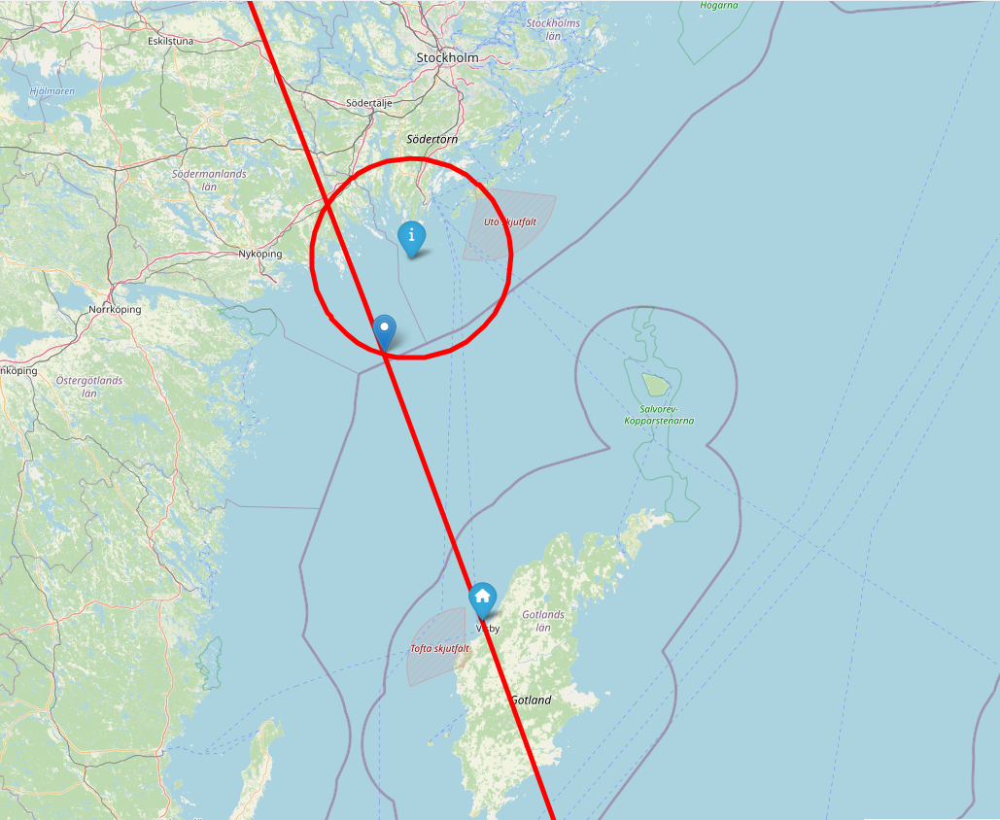

<!---
    © August Linnman, 2025, email: august@linnman.net
    MIT License (see LICENSE file)
-->

# celestial-navigation

## Online Demo

Try out an
[online demo](https://colab.research.google.com/drive/1bZt35-P6aiPlKWktyXgU3he6Di_N-PpA)
of this toolkit! 
*Opens in [Google Colab](https://colab.research.google.com).
You need a Google/Gmail account to run the code in the notebook*.

## Table of contents

1. [Introduction](#introduction)
1. [Making Sights](#making-sights)
    1. [Atmospheric Refraction](#atmospheric-refraction)
    1. [Dip of Horizon](#dip-of-horizon)
    1. [Ignored Corrections](#ignored-corrections)
1. [Sight Reduction (Stationary observer)](#sight-reduction)
    1. [Short note on Earth oblateness](#ellipsoid)
    1. [Using two sights](#using-two-sights)
    1. [Using three or more sights](#using-three-or-more-sights)
    1. [Running the chicago script](#run-chicago-script)
    1. [Azimuth calculation](#azimuth)
    1. [Terrestrial Navigation](#terrestrial)
1. [Dead Reckoning (Moving observer)](#dead-reckoning)
    1. [From <tt>Sight</tt> to <tt>Sight</tt>](#run-sea-script)
    1. [From <tt>LatLon</tt> to <tt>Sight</tt>](#run-sea-script-2)
    1. [Intercept a circle](#intercept-dr)
    1. [Intercept a bearing](#intercept)
    1. [Pure dead reckoning](#pure_dr)
1. [A real-life example](#real-life)
1. [Sextant Calibration](#calibration)
1. [Chronometer Handling](#chronometer)

## 1. Introduction 

This project contains a toolkit (written in Python) to be used for
[celestial navigation](https://en.wikipedia.org/wiki/Celestial_navigation)
together with some demos and documentation.
You can use the toolkit on a mobile phone without internet connection.
If you also have access to a solar powered battery (powerbank) you have a tool
useful while traveling in remote places or on the ocean.

Sights (altitude measurements) have to be obtained using a sextant,
a nautical almanac and an accurate chronometer.
The toolkit takes care of the **sight reduction**
(conversion to estimated location on Earth),
a task that traditionally is performed with careful manual work using special
tables (sight reduction tables), pen, dividers and specialized plotting charts.
Using a calculator can speed up this manual task, and also reduce possible
(human) errors.
A **computer** can do it even quicker, and this toolkit will typically perform
a sight reduction in less than one millisecond.  

* The toolkit supports **stationary** observations, i.e. when observations are
  made from a single position,
  using multiple sights where the position is determined from the
  intersection(s) of the small circles of equal altitude.
  For two sights you will get two possible coordinates.
  For three or more sights you will get one coordinate
  (calculated as a mean value).
* There is also support for **dead reckoning** observations,
  typically at sea on a moving ship. This also needs a working compass and a
  chip log or similar.
  See [below](#dead-reckoning) for more information.
* As a bonus there is also support for **terrestrial navigation**.
  See [below](#terrestrial) for more information.

For more information on installation and usage of the Python scripts see
[here](INSTALL.md).

A short explanation of the logical steps and algorithms used in this toolkit can
be found [here](WORKFLOW.md).

Digital versions of the Nautical Almanac for [2024](NAtrad(A4)_2024.pdf)
and [2025](NAtrad(A4)_2025.pdf)
are included in this repository.

A more detailed description of celestial navigation can be found
[here](https://www.waypointamsterdam.com/Handy_stuf/Short_Guide_To_Astro_navigation.pdf). 

A historical document, the Admiralty Navigational Manual (1938),
from His Majestys Stationary Office (UK) can be found
[here](https://archive.org/details/dli.ernet.211556/mode/2up).

If you wonder why I wrote this in the first place, then see
[this short explanation](WHY.md).

If you want to contribute to the project then see [this page](CONTRIBUTING.md).

## 2. Making sights 

You create a sight with code like this (for the Sun). You specify data from your
sextant and chronometer. You also add tabular data from the
Nautical Almanac. This data is given from the current hour of the observation,
and the next hour.
(You don't have to enter linear factors etc. from the almanac).

    a = Sight (   object_name          = "Sun", \
              set_time             = "2024:05:05 15:55:18+00:00"
              gha_time_0           = "45:50.4", \
              gha_time_1           = "60:50.4", \
              decl_time_0          = "16:30.6", \
              decl_time_1          = "16:31.3", \
              measured_alt         = "55:8:0" \
              )

You can also see a complete example in [a python script](starfixdata_stat_1.py)
and also [a corresponding excel file](chicago.ods).
This sample is built using altitudes taken from a star atlas Stellarium
<https://en.wikipedia.org/wiki/Stellarium_(software)> from a point in central
Chicago on May 5th 2024.
In other words: No sextant readings were made and the accuracy is very good.
(Running this sample will give you an accuracy of just some 100 meters).

The data is picked from your chronometer (clock), dead reckoning (navigation),
weather information, sextant and the Nautical Almanac in the following way.

Arguments in *italics* are optional.

| Argument | Description | Remark | Collected From |
| :------------- | :------------- | :------------- | :------------- |
| object_name | Name of celestial object. | Only mnemonic. | N/A |
| set_time | Time for observation | [Use ISO 8601 format](https://en.wikipedia.org/wiki/ISO_8601) | Chronometer |
| *estimated_position* | An estimation (DR) of the current position. Used for getting better precision regarding oblateness (ellipsoid) calculations and for better elimination of false intersections. NOTE: This position will be re-used for all subsequent <tt>Sight</tt> objects if not re-specified. | A <tt>LatLonGeodetic</tt>. Must be specified at least for the first Sight. | Dead reckoning / Navigation |
| gha_time_0   | GHA reading for this hour. | String with format "DD:MM:SS". For stars use GHA of Aries. | Nautical Almanac |
| gha_time_1   | GHA reading for next hour. | String with format "DD:MM:SS". For stars use GHA of Aries. | Nautical Almanac |
| decl_time_0  | Declination reading for this hour. | String with format "DD:MM:SS".|  Nautical Almanac |
| *decl_time_1*  | Declination reading for next hour. | String with format "DD:MM:SS". Can be skipped for stars. Default = decl_time_0 | Nautical Almanac |
| *sha_diff*   | SHA of star vs Aries in degrees. | String with format "DD:MM:SS". Only use for stars. Otherwise skip. Default = "0". | Nautical Almanac |
| *semidiameter_correction* | Correction for limb measurements.  | Typically used for Moon or Sun. *SD* value (arcminutes), positive (lower limb) or negative (upper limb). Default = 0. | Nautical Almanac |
| *horizontal_parallax* | Correction for horizontal parallax.  | Used for the Moon. *HP* value. Default = 0. | Nautical Almanac |
| measured_alt | Altitude of object in degrees. | String with format "DD:MM:SS". | Sextant |
| *index_error_minutes*    | Specify known index error of sextant. | Default = 0. | Sextant |
| *artficial_horizon*    | Indicates if you use an artificial horizon. True or False. | All sextant readings will be divided by 2. Default = <tt>False</tt>.          | N/A |
| *no_dip* | Use this to eliminate dip of horizon calculation. <tt>True</tt> or <tt>False</tt> | Default = <tt>False</tt> | N/A |
| *observer_height*    | Height of observer above sea level or ground in meters (>= 0). | Only relevant for observations using natural horizon. Default = 0.          | Height Measurement |
| *sextant*            | An object defining a specific used sextant.        | See [this code sample](xtras/starfixdata_xtra_home.py) for details. Default = <tt>None</tt>.       | Sextant Calibration |
| *chronometer*            | An object defining a specific used chronometer.        | See [this code sample](xtras/starfixdata_xtra_home.py) for details. Default = <tt>None</tt>.       | Chronometer Calibration |
| *temperature*            | Measured temperature at observing point. (degrees celsius)        |  Default = 10    | Observations or meteorology information |
| *dt_dh* | Temperature gradient (degrees celsius / meter) | default = -0.01 | Observations or meteorology information |
| *pressure* | Measured pressure at observing point. (kPa) | Default = 101 | Observations or meteorology information |
| *ho_obs* | Set to <tt>True</tt> if dip and refraction corrections should be omitted | Default = <tt>False</tt> | N/A |

### 2.i. Atmospheric refraction

The measured altitude value (parameter *measured_alt*)
is corrected for atmospheric refraction using
[Bennett's empirical formula](https://en.wikipedia.org/wiki/Atmospheric_refraction#Calculating_refraction)
with adjustments for temperature and pressure.

$R = \cot \left( h_a + \frac{7.31}{h_a + 4.4} \right)
\frac{P}{101}\frac{283}{273+T}$

where

* $R$ is the refraction in arc minutes.
* $h_a$ is the measured angle.
* $P$ is pressure in millibars.
* $T$ is temperature in Celsius.

### 2.ii. Dip of horizon

If you specify the *observer_height* parameter you will correct for the dip of
the horizon. This is useful for observations from a ship deck at sea, or from a
hill/mountain with flat surroundings.
The dip is calculated using this formula

$a_{\text{diff}}= \arccos{ \frac{R}{R+h}}$

where

* $a_{\text{diff}}$ is the calculated dip (in radians)
* $R = \frac{r}{1-k}$ (corrected radius of Earth for geodetic refraction)
* $h$ is the elevation of the observer (in meters) above the horizon.
* $r$ is the radius of the Earth (in meters).
* $k = 503\frac{P}{T^2}\left(0.0342+\frac{dT}{dh}\right)$
  (refraction coefficient)
* $P$ is the pressure (in millibars)
* $T$ is the temperature (in Kelvins)
* $\frac{dT}{dh}$ is the temperature gradient. (Rate of temperature change with
 increasing elevation).

If you use an artificial horizon the dip is always zero,
and the *observer_height* parameter should be zero.

For more information about the formula above please refer to
[this article](https://agupubs.onlinelibrary.wiley.com/doi/10.1029/2010JD014067)

### 2.iii. Ignored Corrections

Currently the tool does not aim for very high accuracy and more elaborate
corrections are eliminated.

* Refraction correction is simple (see above), but probably good enough for
basic celestial navigation.

Future implementations may contain more precise corrections though.
See [more about future plans](CONTRIBUTING.md).

## 3. Sight reduction (Stationary observer)

### 3.i. Short note on Earth oblateness

The code contains corrections for Earth oblateness, and intersection work uses
algorithms adpoted to the
[WGS-84 ellipsoid](https://en.m.wikipedia.org/wiki/World_Geodetic_System).
These adjustments are not described here.
The following description only concerns calculations related to a
perfect sphere.
See code for how adjustments and corrections are made to take
real-world Earth oblateness into account.

The current implementation seems to work well for deducing intersections and
sight reduction, but currently the mapping features
(using the MapDevelopers service) are not yet fully accurate.

### 3.ii. Using two sights

Using two star fixes a sight reduction can be done in the following way:

    from starfix import Sight, SightCollection, get_representation, IntersectError
 
    a = Sight (....Parameters....)
    b = Sight (....Parameters....)
    
    collection = SightCollection ([a, b])
    try:
        intersections, _, _ = collection.get_intersections ()
        print (get_representation(intersections,1))
    except IntersectError as ve:
        print ("Cannot get perform a sight reduction. Bad sight data.\n" + str(ve))
        ## For debugging: Get a map where you can look at the intersections
        print ("Check the circles! " + collection.get_map_developers_string())        

You can enter an estimated position (Dead Reckoning Position, **DRP**)
as a parameter.
This will reduce the number of calculations and eliminate intersections being
far off the place where you assume you are located.

        intersections, fitness, diag_output = collection.get_intersections \
        (estimated_position = LatLon (57,19))

The result will be a tuple of **two** coordinates (intersections of two circles
of equal altitude). These intersections can be located far away from each other.
You will have to decide which one of them is the correct observation point,
based on previous knowledge of your location.

The intersections are calculated using an algorithm based on
[this article](https://math.stackexchange.com/questions/4510171/how-to-find-the-intersection-of-two-circles-on-a-sphere)
 
This is a short outline of the algorithm.

For both measurements take note of the measured altitude
(from your **sextant**), $f_1$ and $f_2$.

Using your **chronometer** (clock) register the corresponding
times $t_1$ and $t_2$ for the two measurements.

Define angles $\alpha$ and $\beta$ this way:
$\alpha = \frac{\pi}{2} - f_1$, $\beta = \frac{\pi}{2} - f_2$

From the Nautical Almanac, using the timestamps $t_1$ and $t_2$,
get the geographic position vectors (GP:s) $a$ and $b$.

The GP:s $a$ and $b$ are located on the unit sphere

$a \in \lbrace p \in \mathbb{R}^3 \mid \left|\left|p\right|\right| = 1 \rbrace$
 
$b \in \lbrace p \in \mathbb{R}^3 \mid \left|\left|p\right|\right| = 1 \rbrace$

Now we can define two circles of equal altitude, $A$ and $B$.

$A = \lbrace p \in \mathbb{R}^3 \mid
p \cdot a = \cos \alpha \land \left|\left|p\right|\right| = 1 \rbrace$  
$B = \lbrace p \in \mathbb{R}^3 \mid
p \cdot b = \cos \beta \land \left|\left|p\right|\right| = 1 \rbrace$

(The symbol $\cdot$ denotes a
[dot product](https://en.wikipedia.org/wiki/Dot_product).
The notation $\left|\left|x\right|\right|$ denotes the
[absolute value](https://en.wikipedia.org/wiki/Absolute_value#Vector_spaces)
of the vector $x$.)

The circles relate to a *sight pair* $S_{p_{1,2}} = \{s_1, s_2\}$
which we will come back to later.

(From now on we assume all coordinates/vectors are located on the
**unity sphere**, i.e.
$\lbrace p \in \mathbb{R}^3 \mid \left|\left|p\right|\right| = 1 \rbrace$,
i.e. the Earth is a three-dimensional sphere and its surface has radius = 1)

We aim for finding the intersections $p_1$ and $p_2$ for the circles $A$ and
$B$ ($A \bigcap B$) and the point $q$ being the midpoint
between $p_1$ and $p_2$.

Using the
[Pythagorean Theorem for a Sphere](https://en.wikipedia.org/wiki/Spherical_law_of_cosines)
it is easy to see this:

$\cos\left(a\cdot q\right)\cos\left(p\cdot q\right) = \cos \alpha$  
$\cos\left(b\cdot q\right)\cos\left(p\cdot q\right) = \cos \beta$  

From which we derive this

$q \cdot (a \cos \beta - b \cos \alpha) = 0$

Applying two [cross products](https://en.wikipedia.org/wiki/Cross_product)
(symbol $\times$) and a normalization we can get the value for $q$

$q = N \left( (a \times b) \times (a \cos \beta - b \cos \alpha) \right)$

where $N$ is normalization

$N(x) = \frac{x}{\left|\left|x\right|\right|}$

Now we can find the intersection points by rotating $q$ for an angle of $\rho$
along a rotation axis $r$.  
$\rho$ and $r$ are calculated this way:

$r = \left(a \times b\right) \times q$  
$\rho = \arccos(p \cdot q) = \arccos\left(\frac{\cos \alpha}{a \cdot q}\right) =
\arccos\left(\frac{\cos \beta}{b \cdot q}\right)$

The final rotation is accomplished using
[Rodrigues/Gauss rotation formula](https://en.wikipedia.org/wiki/Rodrigues%27_rotation_formula)
.

$p_{\mathrm{rot}} = q \cos \rho + \left( r \times q \right) \sin \rho +
r \left(r \cdot q \right)\left(1 - \cos \rho \right)$

Apply the formula above for $\rho$ and $-\rho$ and you will get the two
intersection points $p_1$ and $p_2$.
**One of these points matches your location**.

When performing the calculation above we also deduce the intersection angle for
the two small circles (**fitness**). This angle will be used later on when we
compare many different intersections. When the angle is small the error margin
will be rather high and this can be used to reduce the effects of intersections
with big uncertainty. An angle close to 90 degrees however indicates a rather
precise measurement and this should be prioritized.

This is the algorithm for calculating the fitness:

$d_1 = N((p_1 - a) \times a)$  
$d_2 = N((p_1 - b) \times b)$

From this we calculate the fitness factor $\phi$:

$\phi = \left|\left|d_1 \times d_2\right|\right|$  ;  $0<=\phi<=1$

Note: I have chosen to use an algorithm based on 3D cartesian vectors.
Standard literature on sight reduction typically uses 2D spherical coordinates,
such as **Longhand haversine sight reduction** as described
[here](https://en.wikipedia.org/wiki/Sight_reduction#Longhand_haversine_sight_reduction).
Such calculations in 2D are easier to carry out by hand but results in more
complex computer software. The 3D/cartesian approach is more structurally
simple and easier to convert to well-functioning software.

Note: The sight reduction algorithm described above will only work if
at least one of the circles is a small circle.
It cannot be used for calculating intersections of two great circles.

For **two great circles** there is a much simpler algorithm.

The GP:s $a$ and $b$ are still located on the unit sphere.

$a \in \lbrace p \in \mathbb{R}^3 \mid \left|\left|p\right|\right| = 1 \rbrace$
 
$b \in \lbrace p \in \mathbb{R}^3 \mid \left|\left|p\right|\right| = 1 \rbrace$

We now get these circles

$A = \lbrace p \in \mathbb{R}^3 \mid
p \perp a \land \left|\left|p\right|\right| = 1 \rbrace$  
$B = \lbrace p \in \mathbb{R}^3 \mid
p \perp b \land \left|\left|p\right|\right| = 1 \rbrace$

From this it is easy to identify the two intersection points ($A \bigcap B$)
as the cross-products.

$p_1 = N(a \times b)$ 
$p_2 = N(b \times a) = -p_1$

The fitness factor $\phi_{\text{gc}}$ is computed using angles and we get

$\phi_{\text{gc}} = \left|\left| a \times b \right|\right| =
\left|\left| b \times a\right|\right| $

### 3.iii. Using three or more sights

Using three (or more) sights a sight reduction can be done in the following way

    from starfix import Sight, SightCollection, getRepresentation, IntersectError
 
    a = Sight (....Parameters....)
    b = Sight (....Parameters....)
    c = Sight (....Parameters....)
    
    collection = SightCollection ([a, b, c]) # Add more sights if needed
    try:
        intersections, fitness, _ = collection.getIntersections \
        (estimated_position (LatLon(23,45))) ## DRP can be entered if suitable
        print (getRepresentation(intersections,1))
    except IntersectError as ve:
        print ("Cannot get perform a sight reduction. Bad sight data.\n" + str(ve))
        ## For debugging: Get a map where you can look at the intersections
        print ("Check the circles! " + collection.get_map_developers_string())

A *sight* is defined as a collection of data as described in the
[parameters section](#parameters) above, i.e. recorded data for a celestial
object for a specific time.

A collection contains of a set of sights (star fixes) $S$

$S_{\mathrm{sights}} = \lbrace s_1, s_2, \dots s_n  \rbrace $

Now set up a set of sight pairs

$S_p = \lbrace {S_p}_{i,j} | i<=n \land j<=n \land j>i+1 \rbrace$

It is easy to see that the number of sight pairs (the cardinality) can be
calculated like this

$\left|S_p\right| = \frac{n^2 + n}{2} $

For each sight pair we now collect the two corresponding intersection points
($L$ = left, $R$ = right) using the algorithm described
[above](using-two-sights).

$S_{p,i,j} \to \lbrace I_{p,i,j,L},I_{p,i,j,R} \rbrace$

This will result in a set of intersection points

$I_p = \lbrace I_{p,i,j,O} | O \in \{L,R \}
\land i<=n \land j<=n \land j>i+1 \rbrace$

The cardinality can easily be shown as

$\left|I_p\right| = n^2 + n $

For each pair of intersection points we calculate the distance.
The distance is easily calculated using this formula.

$d\left(x,y\right) = \arccos (x \cdot y) $

This will give us the following set

$D = \lbrace d\left(I_k,I_l\right) | k < \left|I\right|
\land l < \left|I\right| \land k <> l \rbrace$

The cardinality of $D$ can be calculated

$\left|D\right| = {\left|I\right|}^2 - {\left|I\right|} = n^4 + 2n^3 - n$

We now need to eliminate all false intersections and only choose those close
to the probable location of the observer.

The final part of the algorithm sorts the set $D$ to
extract a maximum of $\frac{n^2-n}{2}$
intersection points, and also applying a maximal allowed distance limit
(which defaults to 100 km). The **fitness** value (see above) is used for
giving priority (weighting) for intersections with a larger angle.

The final result will be a **single** mean value of the
extracted intersection points.

### 3.iv. Running the Chicago script

This picture shows the small circles defined in the
[starfixdata_stat_1.py](starfixdata_stat_1.py) sample

When we move in closer we can clearly see a precise intersection.
")

The output of the script will be like this:
First we show the two intersection points from two small circles. The second one
is within Chicago.

    ((N 7°,40.8′;W 94°,14.0′);(N 41°,51.2′;W 87°,38.6′))

Then we add another small circle and show the calculated
mean value of the intersections

    (N 41°,51.3′;W 87°,38.6′)

There is also another similar test script in the
[starfixdata_stat_2.py](starfixdata_stat_2.py)
sample where the Moon is used. **Horizontal parallax** is applied to the Moon
using the *HP* field from the Nautical Almanac.
The Moon is typically the only celestial object where horizontal parallax
needs to be considered. For other planets and the Sun the correction will almost
always be obscured by sextant reading errors.

You may also use the supplied Jupyter Notebook scripts
[notebook_stat_1.ipynb](notebook_stat_1.ipynb) and
[notebook_stat_2.ipynb](notebook_stat_2.ipynb).

### 3.v. Azimuth Calculation

The azimuth (compass angle) to a celestial object is normally **not** used as
an input parameter to celestial navigation. But it is an important piece of
information since it can be used to select the correct intersection from a sight
pair (see [above](using-two-sights))
or for just double-checking a sight reduction.

The azimuth of an observed celestial object is computed using this algorithm.

Let $a$ be the GP of the observed object and
$b$ the position of the observer. 
Let $p$ be the North Pole = $[0,0,1]$

The eastern direction $e$ from observer is
computed as  $e = N(p \times b)$  

The northern $n$ direction from observer is
computed as  $n = N(b \times e)$  

The direction vector $d$ from observer to GP is
computed as  $d = N(a-b)$  

The azimuth angle $\phi_{\text{azimuth}}$ can now be computed as 
$\phi_{\text{azimuth}} = \arctan(\frac{d \cdot e}{d \cdot n})$

This [sample](starfixdata_stat_1.py) contains an example of calculation of the
azimuth for sights.

### 3.v Terrestrial Navigation 

A sextant can be used for terrestrial navigation too,
if you orient it horizontally. Typically you take sights of lighthouses when
performing a landfall towards a coast.
[This sample](terrestrial.py) shows an example of this.
The underlying maths are quite similar to sight reduction of star fixes.
You need to find the intersection of two
circles representing equal angle to two terrestrial points.

The following picture shows how the sample results
in two circles of equal angle.
The three small circles are centered on three lighthouses and you have measured
the observed angle between them from your observation point with a sextant.
The red arrow points towards the calculated correct position (intersection).

You may also use the supplied Jupyter Notebook script
[notebook_terrestrial.ipynb](notebook_terrestrial.ipynb).

## 4. Dead Reckoning (Moving observer)

### 4.i. From <tt>Sight</tt> to <tt>Sight</tt>

When sailing (or moving on the ground) you can use this technique to support
dead reckoning where repeated sights (typically of the Sun) will give extra
accuracy. You do this by defining a trip segment like this.

    from starfix import SightTrip, Sight, LatLon
    
    # We are sailing from point s1 to point s2, in the Baltic Sea.  
    # We have a rough estimate of an initial position of 59N;18E to start with
    # This estimate is used for selecting the correct intersection point on Earth.
    s1LatLon = LatLon (59, 18)

    # We define two star fixes  
    s1 = Sight (......) # This is your sight at the start of this trip segment. 
    s2 = Sight (......) # This is your sight at the end of this trip segment.

See above for how to create a sight object

    # We reach s2 by moving in a direction of about 175 degrees for 1 hour
    # (time between taking of sights) with a speed of 20 knots. 
    C_COURSE = 175
    SPEED = 20    
    st = SightTrip (sight_start = s1, sight_end     = s2,\
                    estimated_starting_point        = s1LatLon,\
                    course_degrees                  = C_COURSE,\
                    speed_knots                     = SPEED)

Now you can calculate the coordinates for this trip.

    intersections, _, _ = st.get_intersections ()
    print ("Starting point = " + str(get_representation(intersections[0],1)))
    print ("End point = " + str(get_representation(intersections[1],1)))

The algorithm is a calculation based on distance calculations on segments of the
small circles related to $s_1$ and $s_2$.

The two small circles define a *sight pair* $S_p$ but the two sights are taken
at different times. There are two intersection points $\lbrace p_1,p_2 \rbrace$.
We select the intersection $p_i$ point which is closest to the estimated
starting point $p_e$ by finding the minimum value of $\arccos (p_n \cdot p_e)$

We now define a function on a rotation angle $\rho$
which we will apply on the circle $s_1$

$K(\rho) = \arccos ( (r(s_1,\rho) + t(\phi,\tau))\cdot p_{\text{GPs2}} ) -
(\frac{\pi}{2} - \alpha_{s2})$

where 

* $r$ is a rotation function (based on Rodrigues formula, see above)
* $t$ is a straight movement function based on approximate course $\phi$
  with distance $\tau$.
* $p_{\text{GPs2}}$ is the vector of the *geographic position* of sight $s_2$
* $\alpha_{s2}$ is the altitude measured for $s_2$ (see above for calculation)

The solution of the equation $K(\rho) = 0$ is computed using
[Newton's method](https://en.wikipedia.org/wiki/Newton%27s_method).

The supplied script sample [starfixdata_sea_1.py](starfixdata_sea_1.py) contains
a demo for a short trip at sea (in the Baltic Sea).

This is a picture of the small circles generated by the sample.
The larger circle corresponds to the first observation
with a lower Sun altitude.
The smaller circle is the final observation with a higher Sun altitude.

When we move in closer we can clearly see the intersection $p_i$.
And the course (with our positions) can easily be found using a paralellogram
adjustment where we "squeeze in" a route of 20 NM, course 175 degrees, starting
at the first small circle and ending at the final circle. The classical method
of doing this is of course using a chart and proper plotting equipment and
assume linearity of the circle segments.

")

The script outputs the estimated starting and ending points for our trip segment
(see the red arrow in the map above)

    Starting point = (N 58°,46.1′;E 18°,0.1′)
    End point = (N 58°,26.2′;E 18°,3.5′)

In addition we get some diagnostic information.
First the radius and GP coordinate of the small circle of the first observation.

    S1 radius = 6581.3
    S1 GP     = 23.4367,86.7554

And for the final observation.

    S2 radius = 5722.4
    S2 GP     = 23.4367,71.7571

If you want to plot the trip segment in Google Maps (GM)
you have the coordinates here.

    Starting point GM = 58.7684,18.0023
    Ending   point GM = 58.4364,18.0583

You may also use the supplied Jupyter Notebook script
[notebook_sea_ipynb](notebook_sea.ipynb).

### 4.ii. From <tt>LatLon</tt> to <tt>Sight</tt>

You may also write a script where the starting point is a known position
(<tt>LatLon</tt>) and the target point is defined by a <tt>Sight</tt>.

    from datetime import datetime
    from starfix import Sight, SightTrip, get_representation,\
         LatLon, IntersectError, distance_between_points, km_to_nm

    # This is the starting position
    s1_latlon = LatLon (58.23,17.91)

    # This is the starting time
    s1 = datetime.fromisoformat ("2024-06-20 06:14:38+00:00")

    # This is the Sight we take at finish
    s2 = Sight (  object_name          = "Sun", \
                set_time             = "2024-06-20 07:13:38+00:00", \
                gha_time_0           = "284:35.1", \
                gha_time_1           = "299:35.0", \
                decl_time_0          = "23:26.2", \
                measured_alt         = "38:34:21.6" \
                )

    # We reach s2 by applying about 175 degrees for 1 hour with a speed of 20 knots.
    c_course = 175
    speed = 20
    st = SightTrip (sight_start              = s1,\
                    sight_end                = s2,\
                    estimated_starting_point = s1_latlon,\
                    course_degrees           = c_course,\
                    speed_knots              = speed)

    try:
        intersections, _, _ = st.get_intersections ()
    except IntersectError as ve:
        print ("Cannot perform a sight reduction. Bad sight data.\n" + str(ve))
        print ("Check the circles! " + st.get_map_developers_string())
        exit ()
    print ("MD = " + st.get_map_developers_string ())

    # Diagnostics for map rendering etc.

    assert isinstance (intersections, LatLon)
    print ("Starting point = " + str(get_representation(s1_latlon,1)))
    print ("End point = " + str(get_representation(intersections,1)))
    print ("Distance = " +\
            str(round(km_to_nm(distance_between_points(s1_latlon, intersections)),2)) + " nm")

The algorithm used here is based on two steps.

First perform a straight segment of the dead-reckoning leg.

$p_{\text{start}} \underset{M}{\longrightarrow} p_{\text{trip}}$ ;
   $M$ is 2D (spherical) movement with specified time, speed and course

Secondly, calculate the great circle $C$ from $p_{\text{trip}}$ towards the GP
of the Sight $S$ and deduce the intersection point between $C$ and $S$.
The intersection point is the end of the trip ($p_{\text{end}}$), and marked in
the image below.

")

The supplied script sample [starfixdata_sea_2.py](starfixdata_sea_2.py) contains
a demo for this.

### 4.iii. Intercept a circle

If you start from a specified position (<tt>LatLon</tt>) with a specified course
expecting to intercept a specific circle, such as the first visibility of a
lighthouse you can use a script like this one. This sample also uses a
calculation on line of sight.

    from starfix import LatLon, get_representation,\
                        get_great_circle_route, Circle, get_intersections

    # We are sailing from point s1
    # We have a good estimate of an initial position. (A previous fix)
    s1 = LatLon (57.662, 18.263)
    # We start out at a course of 350 degrees
    c_course = 350
    course_gc = get_great_circle_route (s1, c_course)

    # This is a position of a lighthouse
    light_house = LatLon (58.739, 17.865)
    # This is the elevation of the light source (m)
    light_house_elevation = 44.5
    # This is the maximum reach in nm
    light_house_max_visibility_nm = 22
    light_house_max_visibility_m = nm_to_km (light_house_max_visibility_nm) * 1000
    # This is the elevation of the observer (in the ship)
    observer_elevation = 3
    # Calculate the max line of sight
    line_of_sight = get_line_of_sight (light_house_elevation, observer_elevation)
    # The actual line of sight is the minimum of max reach and line of sight
    actual_line_of_sight = min (line_of_sight, light_house_max_visibility_m)
    actual_line_of_sight_nm = km_to_nm (actual_line_of_sight/1000)

    light_house_circle = Circle (light_house, actual_line_of_sight_nm/60)

    # Get the intersections
    intersections = get_intersections (course_gc, light_house_circle)
    assert isinstance (intersections, tuple)
    print (get_representation(intersections[0],1))

    # Check the circles
    c_c = CircleCollection ([course_gc, light_house_circle, Circle(s1, 1/60)])
    print ("MD = " + c_c.get_map_developers_string())

The picture below illustrates the result

The supplied script sample [starfixdata_sea_3.py](starfixdata_sea_3.py) contains
a demo for this.

### 4.iv. Intercept a bearing

If you are moving on a straight course and expect to intercept a specific
bearing of a lighthouse you can use the following script.

    from starfix import LatLon, get_representation,\
                    get_great_circle_route, Circle, CircleCollection, get_intersections

    # We are sailing from point s1
    # We have a good estimate of an initial position. (A previous fix)
    s1 = LatLon (57.662, 18.263)
    # We start out at a course of 355 degrees
    c_course = 355
    course_gc = get_great_circle_route (s1, c_course)

    # This is a position of a lighthouse
    light_house = LatLon (58.739, 17.865)
    # The intercept angle for the lighthouse is 300 degrees
    light_house_intercept = 300
    light_house_gc = get_great_circle_route (light_house, light_house_intercept)

    # Get the intersections
    intersections = get_intersections (course_gc, light_house_gc)
    assert isinstance (intersections[0], tuple)
    print (get_representation(intersections[0],1))

    intersection1 = Circle (intersections[0][0],1/60)
    start         = Circle (s1, 1/60)

    # Check the circles
    c_c = CircleCollection ([course_gc, light_house_gc, intersection1, start])
    print ("MD = " + c_c.get_map_developers_string())

The supplied script sample [starfixdata_sea_4.py](starfixdata_sea_4.py) contains
a demo for this.

### 4.v. Pure dead reckoning

You can also use a simple script for pure dead reckoning, where you only
know your initial position (<tt>LatLon</tt>), your course, your speed
and time elapsed.

    from datetime import datetime
    from starfix import takeout_course, LatLon, calculate_time_hours, get_representation

    # We are sailing from point s1 to point s2, in the Baltic Sea.
    # We have a good estimate of an initial position. (A previous fix)
    s1 = LatLon (58.23,17.91)
    s1_time = datetime.fromisoformat ("2024-06-20 06:14:38+00:00")

    # We reach s2 by applying about 175 degrees with a speed of 20 knots.
    c_course = 175
    speed = 20
    s2_time = datetime.fromisoformat ("2024-06-20 07:13:38+00:00")
    s1_s2_time = calculate_time_hours (s1_time, s2_time)
    s2 = takeout_course (s1, c_course, speed, s1_s2_time)

    # Print coord of destination
    print (get_representation(s2,1))

The supplied script sample [starfixdata_sea_5.py](starfixdata_sea_5.py) contains
a demo for this.

## 5. A real-life example

You can also see a real-life measurement I recently made using a simple plastic
sextant (Davis Mark III), a standard watch and an artificial horizon.

The sample can be found [here](xtras/starfixdata_xtra_home.py).
The resulting position is just 1.45 nautical miles away from my real position,
which I consider being an excellent result given the simple equipment and my
modest level of training.
But there are some question marks about this accuracy, and I will have to make
more sights since I need to get more training.

## 6. Sextant Calibration 

There are many technical aspects of handling and calibrating a sextant and we
will not mention all these things here, with one exception.
A sextant may show a **gradation error** which can cause errors for larger
measured angles. The little plastic sextant I have used (a Davis Mark III) was
suspected by me,
and I decided to measure it by taking a terrestrial angle fix and compare it to
the data from my map.
And yes, there was an error of about 2 minutes / 10 degrees.
For the details see [this sample](xtras/starfixdata_xtra_home.py) where a
measurement of a local view is used as input to a calibration parameter of the
used sextant.
See the <tt>Sextant</tt> class.

## 7. Chronometer Handling 

Your chronometer may have a **drift** to take care of,
typically if it is mechanical or digital with no auto-setting.
The toolkit contains a <tt>Chronometer</tt> class which can be used to handle
this and you will find an example of handling this in
[this sample](xtras/starfixdata_xtra_home.py).

If you need to set your chronometer away from any other reliable time sources
you may use the method of
[Lunar Distances](https://en.wikipedia.org/wiki/Lunar_distance_(navigation)).
For your help Lunar Distance [tables](LDtable(A4)_2024.pdf)
are bundled in the repository.
