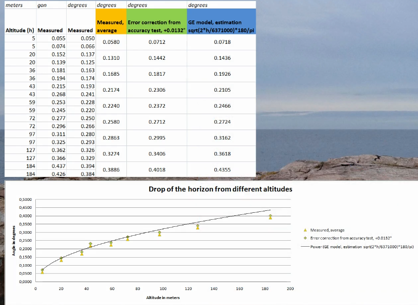

<!---
    © August Linnman, 2025, email: august@linnman.net
    MIT License (see LICENSE file)
-->

# Some notes on horizon dip (Al-Biruni)

The dip of the horizon on a sphere can be calculated with the
exact geometric formula

$d(h) = \arccos \left( \frac{R}{R+h}\right)$

where $R$ is the radius. For the Earth it is ${6.378}\times{10^6}$ m. 
$h$ is observer elevation.

This expression can also (using simple trigonometrics and application
of Pythagoras' formula) be written as:

$d(h) = \arctan \sqrt{\frac{h^2 + 2h}{R}}$

A common observation for lower elevations over Earth's surface is seeing the dip
well approximated by this formula, when measuring with a level,
theodolite or similar: 

$d_{\text{amR}}(h) \approx 1.75 \times \sqrt{h}$

Where $d_{\text{amR}}$ is the observed dip in arcminutes.

Now let us deduce this approximation.

Let's see what happens for small values of $h$:

$d(h)=\arctan\sqrt\frac{h^2 + 2h}{R} \approx \arctan \sqrt\frac{{2h}}{R}$
(when $h$ is small)

It is easy to see that $\arctan$ behaves like a linear function
with derivative $=1$ for low values of $h$:

$\frac{d}{dh}\arctan(h) \approx 1$ (when $h$ is small) 
$\arctan(0) = 0$

From which we get

$\arctan(h) \approx h$ (when $h$ is small)

From this we can deduce the approximation:

$d(h) \approx \sqrt{\frac{2}{R}} \times \sqrt{h}$

From this we get the dip in arcminutes:

$d_{\text{am}}(h) \approx \sqrt{\frac{2}{R}} \times \frac{180}{\pi}
\times 60 \times \sqrt{h}$

Calculating this gives this formula where there is **no refraction**:

$d_{\text{am}}(h) \approx 1.93 \times \sqrt{h}$

So we see a difference, for no refraction ($d_{\text{am}}$)
vs refraction ($d_{\text{amR}}$),
with coefficients $1.93$ vs $1.75$ respectively.
This can easily be explained through a larger "perceived radius" of
the Earth [when refraction is active](https://en.wikipedia.org/wiki/Atmospheric_refraction#Terrestrial_refraction),
and this leads to a lower coeffient in
the formula applicable for refraction above.

From this we can also **calculate the radius**, if we know the coefficient
of the square root formula.

So we observe

$d_{\text{am}}(h) \approx k \times \sqrt{h}$ 
where $k = 1.75$ (refraction, based on observations) or $1.93$ (no refraction,
based on geometry)

From the calculations above it is easy to calculate the radius $R$

$k = \sqrt{\frac{2}{R}} \times \frac{180}{\pi}
\times 60$

from which we get

$R = \frac{{180}^2 \times {60}^2 \times 2}{{\pi}^2 \times k^2}
\approx \frac {2.364 \times 10^7}{k^2}$

From this we can easily get the radius of the Earth ($R$) given the
coefficient ($k$) just like [Al-Biruni did in 1017 AD](https://en.wikipedia.org/wiki/Al-Biruni#Geography_and_geodesy)

Note that Al-Biruni's calculation was made without knowledge of refraction
and also with measurements with partially unkown units of measurement
(in today's units). He also used a rather primitive level device.
He didn't get a very exact result for the radius $R$.
His primary finding was the **method** he used,
and the discovery of the dip of the horizon, allowing for anyone after
him to repeat the experiment.

Insert different values and we get:

$R \approx \frac {2.364 \times 10^7}{1.75^2} = 7.72 \times 10^6$
(which is larger than the real value)

$R \approx \frac {2.364 \times 10^7}{1.93^2} = 6.35 \times 10^6$
(close to the real value)

In the picture below we see a series of actual dip measurements.
For details see [this video](https://youtu.be/6viR_GJ8998?si=JCDL66ikg9gqIYtu). You can clearly see the square root relation here.

If you run [this script](k_factor.py) you will see that the actual $k$ factor
for this test was **$1.88$** which indicates less refraction than the "default"
value of $1.75$. Nevertheless; refraction is difficult and will always create
uncertainties in measurements like this. The overall effect of the horizon dip
and its dependence of increasing elevation is however **very obvious**.

If the theodolite measurements in the YouTube video were used as direct
data for Earth radius calculation we would get:

$R \approx \frac {2.364 \times 10^7}{1.88^2} = 6.659 \times 10^6$ 
which is only about 4 percent larger than the real value.
